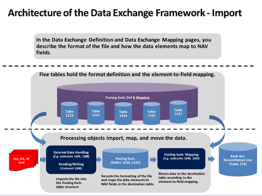
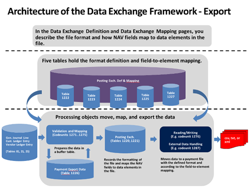

# Om ramverket för datautbyte i [!INCLUDE[d365fin](includes/d365fin_md.md)]About the Data Exchange Framework in [!INCLUDE[d365fin](includes/d365fin_md.md)]
Formatet på filer för utbyte av data i bankfiler, elektroniska dokument, valutakurser och annat med ERP-system varierar beroende på leverantören av datafilen eller strömmen och på land/region.The format of files for exchange of data in bank files, electronic documents, currency exchange rates, and other with ERP systems vary depending on the provider of the data file or stream and on the country/region. [!INCLUDE[d365fin](includes/d365fin_md.md)] stöder olika bankfilformat och datatjänststandarder. supports various bank file formats and data service standards. För att få stöd för andra elektroniska dokumentformat använder du ramverket för datautbyte.To provide support for other electronic document formats, you use the data exchange framework. Mer information finns i [Utbyta data elektroniskt](across-data-exchange.md).For more information, see [Exchanging Data Electronically](across-data-exchange.md).    

 Följande diagram visar arkitekturen för ramverket för datautbyte.The following diagrams show the architecture of the data exchange framework.  

   

   

## Se ävenSee Also  
[Utbyta data elektroniskt](across-data-exchange.md).[Exchanging Data Electronically](across-data-exchange.md)  
[Så här använder du XML-scheman för att förbereda datautbytesdefinitionerHow to: Use XML Schemas to Prepare Data Exchange Definitions](across-how-to-use-xml-schemas-to-prepare-data-exchange-definitions.md)  
[Konfigurera datautbyteSetting Up Data Exchange](across-set-up-data-exchange.md)  
[Utbyta dataExchanging Data](across-exchange-data.md)  
[Inkommande dokumentIncoming Documents](across-income-documents.md)  
[Allmänna affärsfunktionerGeneral Business Functionality](ui-across-business-areas.md)  

