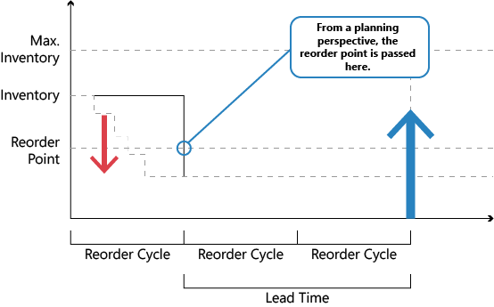

# Designdetaljer: Tidsenhetens roll
Avsikten med tidsenheten är samla efterfråganshändelser i tidsfönstret för att skapa en gemensam leveransorder.  
  
 För partiformningsmetoder som använder en beställningspunkt kan du ange en tidsenhet. Detta säkerställer att efterfrågan inom samma tidsperiod har ackumulerats innan inverkan på planerat lager kontrolleras och om beställningspunkten har passerats. Om beställningspunkten har passerats framåtplaneras en ny leveransorder från slutet av perioden som definieras av tidsenheten. Tidsenheten börjar på planeringsstartdatumet.  
  
 Konceptet med tidsenhet återspeglar den manuella processen för att kontrollera lagernivån ofta istället för vid varje transaktion. Användaren måste definiera frekvens (tidsenheten). Till exempel samlar användaren alla artikelbehov från en leverantör att göra en veckobeställning.  
  
   
  
 Tidsenhet används allmänt för att undvika en kaskadeffekt. Till exempel skapas en balanserad rad med efterfrågan och tillgång där en tidig efterfrågan annulleras, eller ny skapas. Resultatet skulle vara att varje leveransorder (utom den sista) omplaneras.  
  
## Se även  
 [Designdetaljer: Partiformningsmetoder](design-details-reordering-policies.md)   
 [Designdetaljer: Planeringsparametrar](design-details-planning-parameters.md)   
 [Designdetaljer: Hantera partiformningsmetoder](design-details-handling-reordering-policies.md)   
 [Designdetaljer: Leveransplanering](design-details-supply-planning.md)
